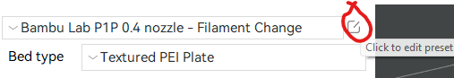
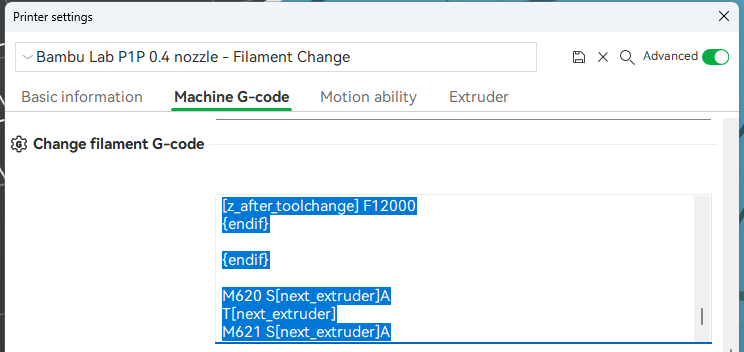

# bambu-a1-manual-filamant-change
### What is this

Manual filament change GCode for bambu lab a1 without AMS

### How to use

Click to edit the preset circled below, and then insert the piece of code below into the top of "Change filament G-code".

**Be cautious!** I only test a few times and it works fine. Be careful while test it on your printers.





(The pictures are from [reddit](https://www.reddit.com/r/BambuLab/comments/11gtlfp/change_filament_gcode_without_ams/))

### GCode

```
; set temp
M104 S[nozzle_temperature_range_high]
; move up
G1 Z{max_layer_z + 10} F1200
; move to the right and cut
G1 X260 F20000
G1 X278 F400
G1 X281 E-5 F80
G1 X260 F6000
M400
; move to the left
G1 X-35 F20000
G1 X-48 F600
M400
; unload
G1 E-100 F1000
M400
; wait for user
M400 U1
; set temp
M109 S[nozzle_temperature_range_high]
; load
G1 E200 F500
M400
; poop
M400
M106 P1 S178
M400 S3
G1 X-38.2 F18000
G1 X-48.2 F3000
G1 X-38.2 F18000
G1 X-48.2 F3000
G1 X-38.2 F18000
G1 X-48.2 F3000
M400
M106 P1 S0
```

